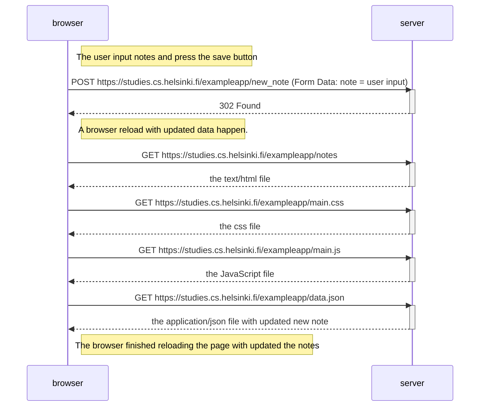

```mermaid
    sequenceDiagram
    participant browser
    participant server

    Note right of browser: The user input notes and press the save button

    browser->>server: POST https://studies.cs.helsinki.fi/exampleapp/new_note (Form Data: note = user input)
    activate server
    server-->>browser: 302 Found
    deactivate server

    Note right of browser: A browser reload with updated data happen.

    browser->>server: GET https://studies.cs.helsinki.fi/exampleapp/notes
    activate server
    server-->>browser: the text/html file
    deactivate server

    browser->>server: GET https://studies.cs.helsinki.fi/exampleapp/main.css
    activate server
    server-->>browser: the css file
    deactivate server

    browser->>server: GET https://studies.cs.helsinki.fi/exampleapp/main.js
    activate server
    server-->>browser: the JavaScript file
    deactivate server

    browser->>server: GET https://studies.cs.helsinki.fi/exampleapp/data.json
    activate server
    server-->>browser: the application/json file with updated new note
    deactivate server

    Note right of browser: The browser finished reloading the page with updated the notes
```
