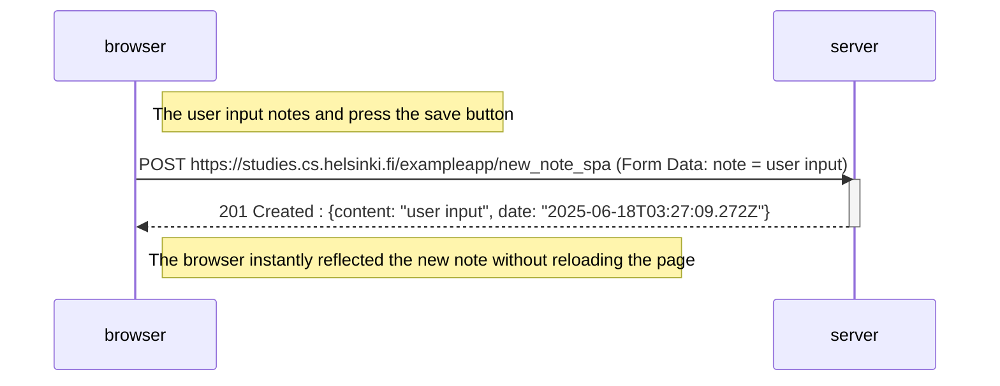

```mermaid
    sequenceDiagram
    participant browser
    participant server

    Note right of browser: The user input notes and press the save button

    browser->>server: POST https://studies.cs.helsinki.fi/exampleapp/new_note_spa (Form Data: note = user input)
    activate server
    server-->>browser: 201 Created : {content: "user input", date: "2025-06-18T03:27:09.272Z"}
    deactivate server

    Note right of browser: The browser instantly reflected the new note without reloading the page
```
